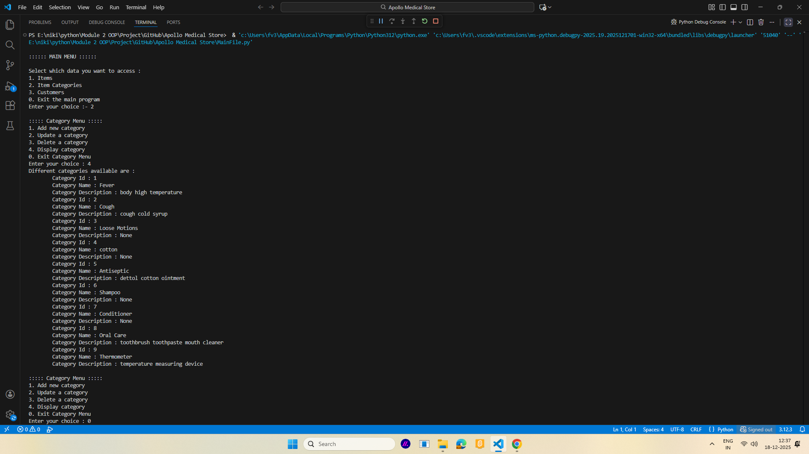
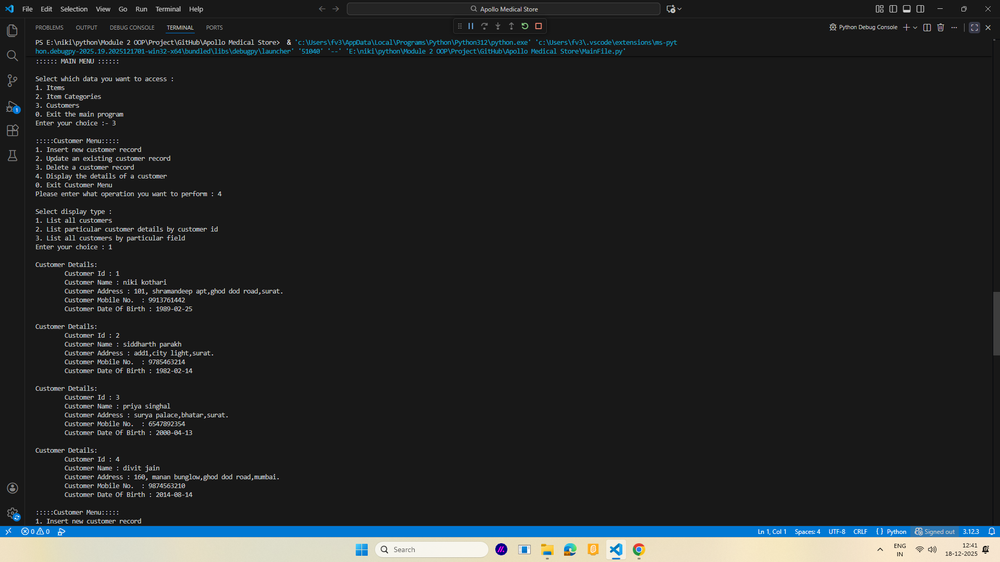
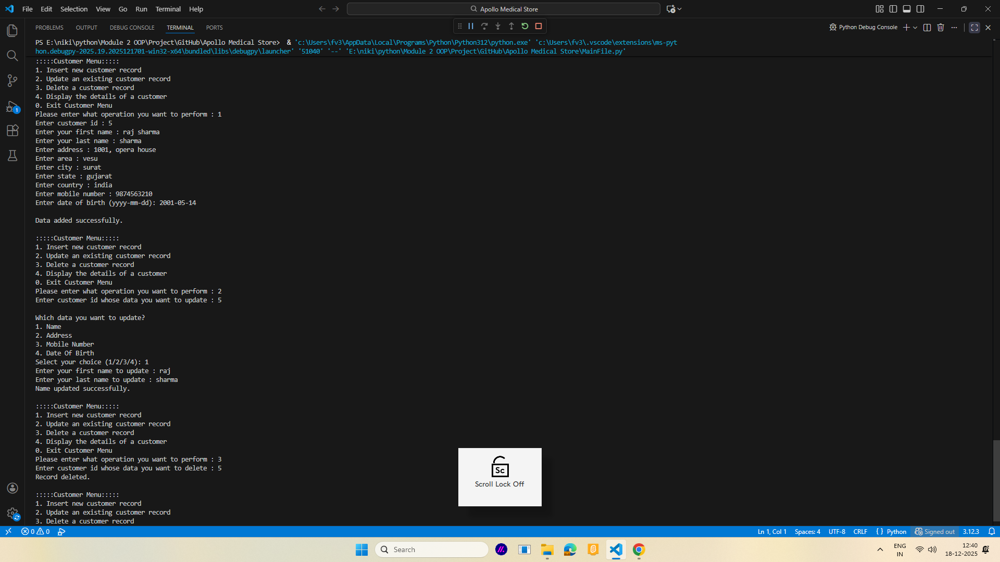

# 🏥 Medical Store Management System

A simple **Medical Store Management System** designed to manage medicines, suppliers, customers, and sales efficiently.  
This project is suitable for learning **database management**, **CRUD operations**, and **basic backend logic** using MySQL.

---

## 📌 Features

- Add, update, delete medical items
- Item category management
- Customer details management
- Supplier management
- Search by different fields

---

## 🛠️ Technologies Used

- Programming Language: Python
- Database: MySQL
- Interface: Console
- Tools: MySQL Workbench, Visual Studio Code

---

## 🗄️ Database Structure

Main tables used:
- `items`
- `customers`
- `category`
- `suppliers`

---

## 🚀 How to Run the Project

1. Clone the repository:
   ```bash
   git clone https://github.com/niki-kothari/Medical-Store-Project.git
   
2. Import the database:

- Open MySQL Workbench

- Import apollomedicaldb.sql

3. Configure database connection:

    Update MySQL host, username, password, and database name in the code

4. Run the application:

    MainFile.py

## 📂 Project Structure
      Medical-Store-Project/
      │__ apollomedicaldb.sql
      ├── images/
      │   └── category.png
      │   └── item.png
      │   └── customer.png
      ├── src/
      │   ├── item.py
      │   ├── category.py
      │   ├── customer.py
      │   └── MainFile.py
      ├── README.md

## 🎯 Purpose of the Project

Academic mini project

Practice MySQL database concepts

Learn CRUD operations

Understand basic real-world pharmacy workflows

## 📚 Explanation
   **Module : Item Category** <br>
      This module have the CRUD functions on the category table having details like category ID, Category type and its description.

   **Module : Items** <br>
      This module have the CRUD functions on the item table having details like item ID, name, category, rate, quantity, manufacturing date, expiry date, supplier, etc.

   **Module : Customer** <br>
      This module have the CRUD functions on the customer table having details like customer ID, name, address, contact no, etc.
      
## ✍️ Few Code Snippets
   **Item Category Module**
      <h5> Add Category </h5>
      
      def addCategory(self):
         ctype = input ('Enter new category type : ')
            if (not ctype):
                print('Category name cannot be null')
                self.addCategory()
            else:
                description = input ('Enter category descriptioon : ')
                sql = "insert into category (c_type, description) values ('%s', '%s')"%(ctype, description)
                self.cursor.execute(sql)
                self.db.commit()

   <h5> Delete Category </h5>

      def deleteCategory(self):
        ctype = input('Enter category you want to delete : ')
        search_pattern = "%" + ctype + "%"
        sql = "select * from category where c_type like %s"
        self.cursor.execute(sql, (search_pattern,))
        data = self.cursor.fetchall()
        if (not data):
            print('No such category found')
        else:
            for i in data:
                sql = "delete from category where category_id = '%d'"%(i[0])
                self.cursor.execute(sql)
                self.db.commit()
                
   **Item Module**   
   <h5> Update Item </h5>

       def updateItemDetail(self, field, field_value, id):
               sql = "update item set %s = '%s' where item_id = %d"%(field, field_value, id)
               self.cursor.execute(sql)
               self.db.commit()
   
       def updateItem(self):
           itemId = int(input('Enter Item ID which item details you want to update : '))
           if (not self.isAvailable('item_id', itemId)):
               print ('No such record found.')
           else:
               print ('\nWhich data you want to update?')
               print ('1. Item Name')
               print ('2. Item Rate')
               print ('3. Item Stock')
               print ('4. Item Rack Location')
               print ('5. Item Category')
               curr_selection = int(input('Select your choice : '))
               if (curr_selection == 1):
                   iname = input('Enter item name to update : ')
                   self.updateItemDetail('i_name',iname, itemId)
                   print ('Item Name updated successfully.')
               elif (curr_selection == 2):
                   irate = input('Enter item rate to update : ')
                   self.updateItemDetail('i_rate',irate, itemId)
                   print ('Item Rate updated successfully.')
               elif (curr_selection == 3):
                   istock = input('Enter item stock to update : ')
                   self.updateItemDetail('i_stock_qty',istock, itemId)
                   print ('Item stock updated successfully.')
               elif (curr_selection == 4):
                   irack = input('Enter item rack location to update : ')
                   irack = self.getRackId(irack)
                   self.updateItemDetail('rack_id',irack, itemId)
                   print ('Rack location updated successfully.')
               elif (curr_selection == 5):
                   icategory = input('Enter item category to update : ')
                   icategory = self.getCategoryId(icategory)
                   self.updateItemDetail('category_id',icategory, itemId)
                   print ('Item Category updated successfully.')
               else:
                   print('Wrong choice entered.')

   **Customer Module**
   <h5> Display Customer </h5>

       def displayCustomerByField(self, field, field_value):
            sql = "select * from customer where %s='%s'"%(field, field_value)
            self.cursor.execute(sql)
            customer_list = self.cursor.fetchall()
            if (customer_list): 
                for cust in customer_list:
                    self.printCustomerDetail(cust)
            else:
                print('No such customer found')                

       def printCustomerDetail(self, cust):
           print ('\nCustomer Details: ')
           print (f'\tCustomer Id : {cust[0]}')
           print (f'\tCustomer Name : {cust[1]} {cust[2]}')
           print (f'\tCustomer Address : {cust[3]},{cust[4]},{cust[5]}.')
           print (f'\tCustomer Mobile No.  : {cust[8]}')
           print (f'\tCustomer Date Of Birth : {cust[9]}')

## 📸 Screenshots
   **Display Item Category Screenshot**
      <br>
   <br><br>
   **Display Customer Screenshot**
      <br>
   <br><br>
   **Add Customer Screenshot**
      <br>
   
## 🤝 Contributing

Contributions are welcome!
Feel free to fork this repository and submit pull requests.

## 📄 License

This project is for educational purposes only.

## 👨‍💻 Author

Niki Kothari
GitHub: https://github.com/niki-kothari
